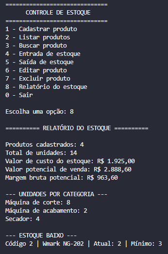

# Controle de Estoque em Python

Sistema de controle de estoque desenvolvido em Python como projeto de portfólio para aplicação prática de conceitos de lógica de programação, estruturas de dados, funções, manipulação de arquivos JSON e versionamento com Git/GitHub.

O projeto foi inspirado em uma necessidade real de organização de produtos de uma assistência técnica e loja de equipamentos profissionais.

## Funcionalidades

- Cadastro de produtos
- Listagem de produtos
- Busca por código, categoria, marca ou modelo
- Busca parcial com tratamento de maiúsculas, minúsculas e acentos
- Entrada de estoque
- Saída de estoque
- Edição de produtos
- Exclusão com confirmação
- Controle de estoque mínimo
- Preço de custo e preço de venda
- Relatório geral do estoque
- Valor total de custo do estoque
- Valor potencial de venda
- Margem bruta potencial
- Agrupamento de unidades por categoria
- Identificação de produtos com estoque baixo
- Persistência dos dados em arquivo JSON
- Validação e tratamento de entradas inválidas

## Dados de cada produto

Cada produto possui:

- Código
- Categoria
- Marca
- Modelo
- Cor
- Quantidade
- Preço de custo
- Preço de venda
- Estoque mínimo

## Tecnologias utilizadas

- Python
- JSON
- Git
- GitHub

O projeto utiliza apenas módulos da biblioteca padrão do Python, portanto não é necessário instalar dependências externas.

## Como executar

### 1. Clone o repositório

```bash
git clone https://github.com/gabriel-dorneles/controle-de-estoque-python.git
```

### 2. Entre na pasta do projeto

```bash
cd controle-de-estoque-python
```

### 3. Execute o programa

```bash
python main.py
```

## Menu principal

```text
==============================
      CONTROLE DE ESTOQUE
==============================

1 - Cadastrar produto
2 - Listar produtos
3 - Buscar produto
4 - Entrada de estoque
5 - Saída de estoque
6 - Editar produto
7 - Excluir produto
8 - Relatório do estoque
0 - Sair
```

## Exemplo de relatório

```text
========== RELATÓRIO DO ESTOQUE ==========

Produtos cadastrados: 5
Total de unidades: 18
Valor de custo do estoque: R$ 2.450,00
Valor potencial de venda: R$ 3.720,00
Margem bruta potencial: R$ 1.270,00

--- UNIDADES POR CATEGORIA ---
Máquina de corte: 8
Máquina de acabamento: 6
Secador: 4

--- ESTOQUE BAIXO ---
Código 3 | Kemei KM-2299 | Atual: 2 | Mínimo: 3
```

## Demonstração



## Estrutura do projeto

```text
controle-de-estoque-python/
│
├── docs/
│   └── relatorio-estoque.png
├── main.py
├── produtos.json
├── README.md
└── .gitignore
```

## Conceitos praticados

Durante o desenvolvimento deste projeto foram aplicados conceitos como:

- Variáveis e tipos de dados
- Estruturas condicionais
- Laços de repetição
- Listas e dicionários
- Funções
- Tratamento de exceções
- Validação de dados
- Manipulação de arquivos
- Persistência com JSON
- Normalização e busca de textos
- Reutilização de código
- Operações CRUD
- Versionamento com Git

## Melhorias futuras

Como evolução do projeto, pretendo implementar:

- Interface gráfica ou web
- Banco de dados SQL
- Histórico de movimentações
- Cadastro de fornecedores
- Relatórios mais detalhados
- Autenticação de usuários

## Autor

**Gabriel Brizolla Dorneles**

Estudante de Engenharia de Software — UNINTER

[LinkedIn](https://www.linkedin.com/in/gabriel-brizolla-dorneles-8b482714b/) | [GitHub](https://github.com/gabriel-dorneles)
